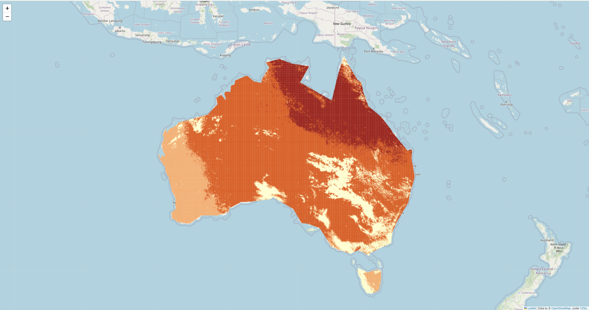

# -folium-to-create-a-irradiance-map-for-Australia-
 This project is about how to use folium package in python to create a irradiance map for Australia based on csv file

 The giving csv data can be finally translated to this png format with the shape of Australia

